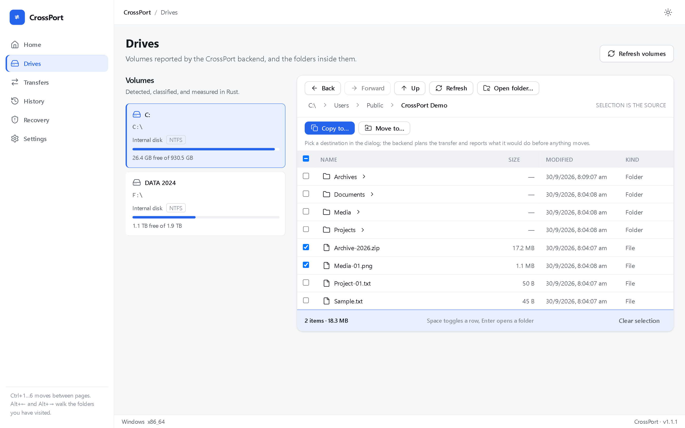

# CrossPort

**A professional file-transfer utility for moving and verifying files across
mounted volumes.**

CrossPort copies and moves files and folders between the drives your operating
system has already mounted, shows you exactly what a transfer will do before it
starts, and proves what landed when it finishes. It runs offline: no account, no
telemetry, no background synchronization.

**Windows 10 1607+ / Windows 11, 64-bit** is the only packaged and tested
platform today. Linux and macOS are application foundation only.



---

## Core capabilities

- Browse mounted volumes and the folders inside them, with real metadata
  (kind, filesystem, capacity, read-only state, mounted state).
- Select files and folders, then **copy** or **move** them recursively.
- Resolve name conflicts with **Replace**, **Skip**, or **Rename**.
- Review a backend **dry run** before anything is queued — where each source
  lands, item and byte counts, free space, conflict behaviour, and warnings.
- **Verify** what was written: size by default, optional SHA-256 while
  copying, or none.
- Watch live byte, speed, and ETA progress; **pause**, **resume**, or
  **cancel** with partial-output cleanup.
- Keep a **history** of finished transfers with per-record verdicts.
- **Recover** interrupted transfers with an explicit decision — restart,
  discard, or confirm. Nothing restarts automatically.
- Report read-only and unavailable volumes honestly instead of failing silently.

The full public matrix — what is current, what is deliberately not, and what is
future — is in [`docs/product/CAPABILITY_MATRIX.md`](docs/product/CAPABILITY_MATRIX.md).

## Why CrossPort exists

Moving files between two drives is routine, and doing it safely is harder than
it looks. Routine tools copy without telling you where each item will land or
whether the bytes arrived intact, and a cancelled or crashed transfer can leave
a half-written file that looks finished.

CrossPort is built around three ideas:

- **Review before it moves.** A transfer is planned first, and the plan is
  shown before anything is written.
- **Prove what landed.** Verification is part of the job, and every verdict
  states what was checked and what was not.
- **Never guess about interrupted work.** An interrupted transfer is
  classified and handed to you; it is never silently resumed or reported as
  complete.

It is free, offline, and cross-platform by design. Windows is what ships today.

## Supported platform

| Platform | Status |
| --- | --- |
| **Windows 10 1607+ / Windows 11, 64-bit** | **Supported.** The only packaged and tested target. |
| Linux | Not built, not tested, not supported — application foundation only. |
| macOS | Not built, not tested, not supported — application foundation only. |

Requirements:

- Microsoft Edge WebView2 runtime. Windows 11 and current Windows 10 include
  it; the installer bootstraps it silently when it is missing.
- Paths longer than 260 characters need Windows long-path support enabled.
  Without it, Windows refuses them and CrossPort reports the failure.

CrossPort is an **application, not a filesystem driver**. It moves files across
volumes your OS has already mounted. It does **not** mount, format, or repair
volumes, does not add native NTFS write access on macOS, and loads no kernel or
system extension. See
[`docs/product/PLATFORM_SUPPORT.md`](docs/product/PLATFORM_SUPPORT.md) and
[`docs/product/PARAGON_CAPABILITY_GAP.md`](docs/product/PARAGON_CAPABILITY_GAP.md).

## Download / Installation

The Windows installers are attached to the GitHub Release for the current
version:

- **[GitHub Releases](../../releases/latest)** — `CrossPort_<version>_x64-setup.exe`
  (NSIS, per-user) and `CrossPort_<version>_x64_en-US.msi` (WiX MSI), each with
  a SHA-256 digest in `checksums.txt`.

To install:

1. Download `CrossPort_<version>_x64-setup.exe` (recommended) or the `.msi`.
2. Run it. The NSIS installer installs for the current user into
   `%LOCALAPPDATA%\CrossPort`, adds a Start-menu entry and a desktop shortcut.
   No account and no setup step are involved.
3. Start CrossPort from the Start menu.

To remove it, use **Apps → Installed apps → CrossPort → Uninstall**.
Uninstalling removes the program, shortcuts, and registry entry. Your settings,
history, and logs live under `%APPDATA%\com.crossport.app` and
`%LOCALAPPDATA%\com.crossport.app`; CrossPort never deletes those for you.

The installers are **not code-signed**, so Windows shows an unknown-publisher
warning on first install. Verify a download with:

```bash
sha256sum -c checksums.txt
```

## Quick usage flow

1. **Open a volume** on the Drives page — the left rail lists the volumes the
   backend detected, with their filesystem and free space.
2. **Walk into folders** with the breadcrumb, by double-clicking, or with
   `Alt`+arrow keys.
3. **Tick the rows** you want to transfer. The selection is the source.
4. Choose **Copy to…** or **Move to…** and pick a destination. The composer
   shows the backend's plan — items, bytes, free space, conflict behaviour,
   verification policy, and warnings.
5. **Start** the transfer and follow it on the Transfers page: live progress,
   pause/resume/cancel, and the verification verdict.
6. Find finished jobs in **History**, and anything interrupted in **Recovery**.

`Ctrl`/`Cmd`+`1`…`6` move between pages.

## Safety and verification model

- **Plan before write.** `plan_transfer` is read-only: it reports what would
  happen and touches nothing.
- **Validated paths in Rust.** Paths are normalized and validated before use;
  symlinks and reparse points are reported but never followed, copied, or
  removed.
- **Refusals that matter.** A transfer into itself, a destination inside its
  source, and a destination without enough free space are refused before work
  starts.
- **Verification is explicit.** `size` (default) compares the written length
  against the plan; `checksum` compares a SHA-256 digest of the bytes read from
  the source against the file on disk; `none` verifies nothing and says so.
- **Honest verdicts.** Every result states what was checked and what was not.
  Modified times, attributes, ownership, and alternate data streams are **not**
  reapplied.
- **A failed check fails the job.** A mismatch fails its item while keeping the
  file it wrote, so you can inspect it.
- **Moves keep the source** when anything failed.
- **Recovery is never automatic.** Interrupted work is classified into explicit
  outcomes and left for you to restart, discard, or confirm.

The security model (restrictive CSP, a minimal Tauri capability surface, and
logging that records job identifiers but never file contents) is documented in
[`SECURITY.md`](SECURITY.md) and
[`docs/architecture/SYSTEM_ARCHITECTURE.md`](docs/architecture/SYSTEM_ARCHITECTURE.md).

## Current limitations

- **Windows only.** No macOS or Linux artifact is built or tested.
- **Not code-signed**, so Windows shows an unknown-publisher warning.
- **A downgrade is not refused.** The interactive installer reports that a
  newer version is installed and replaces it only after uninstalling it, and a
  silent install (`/S`) replaces it outright. Install only a build you mean to
  run. There is no auto-updater.
- **One transfer runs at a time**, by design. A second job waits in the queue.
- **History is bounded** (200 records by default; 2,000 at most) and pruned on
  write, so it is a record of recent work, not an audit log.
- **Verification proves only the claims it lists.** Metadata is not reapplied.
- **No byte-offset resume.** An interrupted transfer is restarted or discarded
  whole, and CrossPort says so before either.
- **Source/destination containment is decided lexically**, not by resolving the
  filesystem. Two spellings of the same location (an 8.3 short name, or a path
  through a junction) are not recognized as the same directory.
- **Long paths** need Windows long-path support enabled.

## Future roadmap

Directions, not commitments — no dates. The short version:

- **Now:** the Windows 1.1 line (see [`ROADMAP.md`](ROADMAP.md)).
- **Next:** realistic engineering work on the Windows product — broader
  verification coverage, queue ergonomics, and packaging polish.
- **FUTURE / platform-specific:** Linux and macOS builds and their QA, code
  signing, and an update path. These require platform builds and signing
  infrastructure that do not exist yet.

Filesystem-driver capabilities (mounting, formatting, repairing, or adding
native NTFS write access) are **out of scope** and are not planned. See
[`NON_GOALS.md`](NON_GOALS.md) and
[`docs/product/PARAGON_CAPABILITY_GAP.md`](docs/product/PARAGON_CAPABILITY_GAP.md).

## Technical stack and architecture

| Layer | What it is |
| --- | --- |
| Shell | Tauri 2 desktop application |
| Frontend | React 19 + TypeScript + Vite, design-token UI system, Zustand stores |
| Backend | Rust: the transfer engine, verification, persistence, recovery, history, and every filesystem decision |
| Boundary | One typed IPC layer with structured `{ code, message }` errors; the webview is granted only Tauri core defaults |

The frontend is feature-folder based and never touches a path itself. Every
backend call goes through one transport module that validates payloads and
normalizes failures. Transfer documents (state and history) go through one
atomic, versioned layer that survives a crash. See
[`docs/architecture/SYSTEM_ARCHITECTURE.md`](docs/architecture/SYSTEM_ARCHITECTURE.md)
for the full picture.

## Development and verification

Built with Node.js ≥ 22, pnpm 10, and a stable Rust toolchain. See
[`docs/development/SETUP.md`](docs/development/SETUP.md) and
[`CONTRIBUTING.md`](CONTRIBUTING.md).

The suite that guards every change:

```bash
pnpm check                     # Biome
pnpm lint                      # ESLint
pnpm --filter desktop build    # typecheck + production build
pnpm test                      # Vitest (includes the performance budgets)

cd apps/desktop/src-tauri
cargo fmt --check
cargo check --all-targets
cargo clippy --all-targets -- -D warnings
cargo test                     # includes real-file transfer and recovery tests

bash scripts/check-versions.sh # version sync across all four manifests
```

CI ([`.github/workflows/ci.yml`](.github/workflows/ci.yml)) runs those checks
on Linux and runs the Rust suite on Windows, where the shipping behaviour
actually lives. Performance is measured on real Windows workloads and bounded
by tests — see [`docs/development/PERFORMANCE.md`](docs/development/PERFORMANCE.md).

Release artifacts are built locally on Windows with `bash scripts/release.sh`,
which produces the NSIS installer, the MSI, and `checksums.txt`. See
[`docs/development/RELEASE_PROCESS.md`](docs/development/RELEASE_PROCESS.md).

## Support

CrossPort is free and offline: no account, no telemetry, no ads. If it has been
useful to you, you can support its development.

**UPI (India):** `9321614988@jio`

<a href="https://p4inz-code.github.io/donate/"></a>

[Open the donation page](https://p4inz-code.github.io/donate/). Outside India,
or prefer a card?

<a href="https://buymeacoffee.com/p4inz"></a>

## License

MIT — see [`LICENSE`](LICENSE). Copyright © 2026 CrossPort Contributors.
Third-party dependency licenses are summarized in
[`docs/legal/THIRD_PARTY_LICENSES.md`](docs/legal/THIRD_PARTY_LICENSES.md).

## Documentation

| Document | What it covers |
| --- | --- |
| [`docs/product/CAPABILITY_MATRIX.md`](docs/product/CAPABILITY_MATRIX.md) | Current vs. not-current vs. future capabilities |
| [`docs/product/PLATFORM_SUPPORT.md`](docs/product/PLATFORM_SUPPORT.md) | Platform support, precisely |
| [`docs/product/PARAGON_CAPABILITY_GAP.md`](docs/product/PARAGON_CAPABILITY_GAP.md) | Why CrossPort is not a filesystem driver |
| [`docs/release/RELEASE_1.1.1.md`](docs/release/RELEASE_1.1.1.md) | The current release: what changed and what was verified |
| [`ROADMAP.md`](ROADMAP.md) | Engineering phases and future direction |
| [`CHANGELOG.md`](CHANGELOG.md) | Version history |
| [`docs/architecture/`](docs/architecture) | Transfer engine, verification, persistence, recovery, security |
| [`docs/reference/FAQ.md`](docs/reference/FAQ.md) | Common questions |
| [`docs/reference/GLOSSARY.md`](docs/reference/GLOSSARY.md) | Terminology |
| [`SUPPORT.md`](SUPPORT.md) | Getting help |
| [`SECURITY.md`](SECURITY.md) | Reporting a vulnerability |
